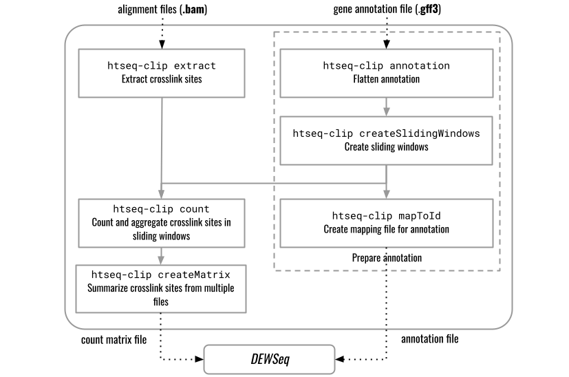

.. htseq-clip documentation master file, created by
   sphinx-quickstart on Fri Jan 24 10:26:08 2020.
   You can adapt this file completely to your liking, but it should at least
   contain the root `toctree` directive.

=====================================
htseq-clip
=====================================

htseq-clip is a toolset for the analysis of eCLIP/iCLIP datasets. 
This python package can be used to generate files necessary for 
data analysis using the companion R/Bioconductor package `DEWSeq`_

.. _`DEWSeq`: https://bioconductor.org/packages/release/bioc/html/DEWSeq.html

   htseq-clip data flow diagram

.. toctree::
   :maxdepth: 2
   :caption: Contents:

   overview
   installation
   documentation
   references

   
`Matthias Hentze`_ and `Wolfgang Huber`_ Labs, `EMBL Heidelberg`_.

.. _`Matthias Hentze`: https://www.embl.de/research/units/directors_research/hentze/index.html

.. _`Wolfgang Huber`: https://www.embl.de/research/units/genome_biology/huber/index.html

.. _`EMBL Heidelberg`: https://www.embl.de/

