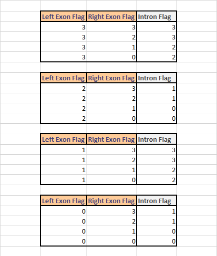

.. raw:: html

    

.. role:: c1

overview
=========

**htseq-clip**

htseq-clip is a toolset designed for the processing and analysis of eCLIP/iCLIP dataset.
This package is designed primarily to do the following operations:

:ref:`Prepare annotation <AnnotationOverview>`
***************************************

A suite of functions to process and flatten genome annotation file. 

:c1:`annotation`

:ref:`annotation function <annotation>` takes as input a GFF formatted genome annotation file and converts the annotations from GFF format to bed format.
For an example, this function converts the following GFF annotation

.. _GFFTable:

.. list-table::
   
  * - chr1
    - HAVANA
    - exon
    - 1373730
    - 1373902
    - .
    - \-
    - .
    - ID=exon:ENST00000338338.9:4;Parent=ENST00000338338.9;gene_id=ENSG00000175756.13;transcript_id=ENST00000338338.9;gene_type=protein_coding;gene_name=AURKAIP1;transcript_type=protein_coding;transcript_name=AURKAIP1-202;exon_number=4;exon_id=ENSE00001611509.1;level=2;protein_id=ENSP00000340656.5;transcript_support_level=1;tag=basic,appris_principal_1,CCDS;ccdsid=CCDS25.1;havana_gene=OTTHUMG00000001413.3;havana_transcript=OTTHUMT00000004082.2

and converts this entry into the following BED6 format

.. _BEDTable:

.. list-table::
    :header-rows: 1
    
    * - chromosome
      - start
      - end
      - name
      - score
      - strand
    * - chr1
      - 13737329
      - 1373902
      - ENSG00000175756.13@AURKAIP1@protein_coding@exon@2/2@ENSG00000175756.13:exon0002
      - 0
      - \-
Various attributes in the name column in this BED entry is seperated by ``@`` and the
order is given below

.. _AttibTable:

.. list-table::
    :widths: 3,10
    :header-rows: 1
    

    * - atrribute
      - attribute description 
    * - ENSG00000175756.13
      - gene id
    * - AURKAIP1
      - gene name
    * - protein_coding
      - gene type
    * - exon
      - gene feature (exon, intron, CDS,...)
    * - 2/4
      - 2nd exon out of a total of 2 exons of this gene
    * - ENSG00000175756.13:exon0002
      - unique id, merging gene id feature and feature number

``score`` column in the BED file is re-purposed to indicate a ``flag`` which can be used as a measure of trust worthiness/
as a filter option for further analysis.

Flag can have the following different values:

.. _FlagTable:

.. list-table::
    :widths: 3,10,5
    :header-rows: 1

    * - Flag
      - description
      - | trust
        | worthiness
    * - 3
      - only one variant of start/end positions
      - high
    * - 2
      - same start position but different end positions
      - medium
    * - 1
      - different start positions but same end position
      - medium
    * - 0
      - different start and end positions
      - low
    

An exon from a  gene can belong to multiple isoforms and therefore can have different start/end positions. ``htseq-clip`` combines
all the position informations for each exon to one and takes the lowest/highest value as start/end position. As it is shown in the cartoon below,
the first exon belongs to 3 different isoforms, so the Flag is ``0`` (trust worthiness: low) as the stand and end positions varies. The second exon belongs
to two different isoforms, but there is only one unique start and end postion, hence the Flag is ``3`` (trust worthiness: high)

.. figure:: flags.png
   :width: 35% 
   :align: center

   Cartoon showing how flag generation process

The corresponding intron Flag is calculated as follows: 
if the left exon Flag is 0 and the right exon Flag is 3 the intron Flag is 1 :
because for the start position(s) can exist different variants, but for the end position(s) there exist only one variant. The intron flag is calculated 
depending on the 2 exon flags where the intron is between. Given below is a table to lookup which variations of exon flags yield to the corresponding intron flag.

   Intron Flag lookup table

:c1:`createSlidingWindows`

:ref:`createSlidingWindows function <createSlidingWindows>` takes as input a flattened annotation BED file
created by the annotation function and splits each individual BED entries into overlapping windows. 
``--windowSize`` parameter controls the size of each window and ``--windowStep`` controls the overlap 
of each neighboring windows from the same feature

Continuing with the example entry above, the first 5 sliding windows generated from the
:ref:`BED6 flattened entry <BEDTable>` are given below:

.. _SWTable:

.. list-table::
    :header-rows: 1
        
    * - chromosome
      - start
      - end
      - name
      - score
      - strand
    * - chr1
      - 1373729
      - 1373779
      - ENSG00000175756.13@AURKAIP1@protein_coding@exon@2/2@ENSG00000175756.13:exon0002W00001@1
      - 0
      - \-
    * - chr1
      - 1373749
      - 1373799
      - ENSG00000175756.13@AURKAIP1@protein_coding@exon@2/2@ENSG00000175756.13:exon0002W00002@2
      - 0
      - \-
    * - chr1
      - 1373769
      - 1373819
      - ENSG00000175756.13@AURKAIP1@protein_coding@exon@2/2@ENSG00000175756.13:exon0002W00003@3
      - 0
      - \-
    * - chr1
      - 1373789
      - 1373839
      - ENSG00000175756.13@AURKAIP1@protein_coding@exon@2/2@ENSG00000175756.13:exon0002W00004@4
      - 0
      - \-
    * - chr1
      - 1373809
      - 1373859
      - ENSG00000175756.13@AURKAIP1@protein_coding@exon@2/2@ENSG00000175756.13:exon0002W00005@5
      - 0
      - \-

Each sliding window listed here is 50bp long, as default value for ``--windowSize`` argument is ``50``  and the difference between
start positions of each is 20bp, as the default value for ``--windowStep`` argument is ``20`` 

Following the convention in :ref:`flattened annotation <BEDTable>` the attributes in sliding windows name column are also seperated by ``@`` 
and the first 5 attributes in the name column here are exactly the same as that of :ref:`flattened annotation name column <AttibTable>`
An example is given below

.. _SWAttibTable:

.. list-table::
    :header-rows: 1

    * - atrribute
      - attribute description
      - Found in :ref:`flattend name attribute <AttibTable>`
    * - ENSG00000175756.13
      - gene id
      - Yes
    * - AURKAIP1
      - gene name
      - Yes
    * - protein_coding
      - gene type
      - Yes
    * - exon
      - gene feature (exon, intron, CDS,...)
      - Yes
    * - 2/2
      - 2nd exon out of a total of 2 exons of this gene
      - Yes
    * - ENSG00000175756.13:exon0002W00001
      - unique id, merging gene id feature, feature number and window number (W : window)
      - No
    * - 1
      - 1st window of this feature 
      - No
 
.. Note:: There will be zero overlap between neighboring windows from two separate gene features

:ref:`Extract crosslink sites <ExtractionOverview>`
**************************************
Extract and process crosslink sites from alignment file.

:c1:`extract`

:ref:`extract function <extract>` takes as input an alignment file (.bam) and extracts and 
writes either start, insertion, deletion, middle or end site into a BED6 formatted file.
The argument ``--site``  determines crosslink site choice.

Given below is an example paired end sequence and start, middle and end positions extracted from the second mate of this fragment

.. _AlignTable1:

.. list-table::

  * - TTATTACAGC\:K00180\:131\:H7J3YBBXX\:3:2123:15057:19918
    - 99
    - chr1
    - 1373726
    - 255
    - 33M
    - \=
    - 1373729
    - 41
    - TTTTAAAGGCTGAGTCCTCTGAGAATTTATTAC
    - JJJJJJJJJJJJJJJJJJJJJJJJJJJJJJJJJ
    - NH:i:1
    - HI:i:1
    - AS:i:60
    - nM:i:5
    - NM:i:4
    - MD:Z:0C0A0G0G29
    - jM:B:c,-1
    - jI:B:i,-1
    - RG:Z:foo
  * - TTATTACAGC\:K00180\:131\:H7J3YBBXX\:3:2123:15057:19918
    - 147
    - chr1
    - 1373729
    - 255
    - 38M
    - \=
    - 1373726
    - \-41
    - TAAAGGCTGAGTCCTCTGAGAATTTATTACTACGGATC
    - JJJJJJJJJJJJJJJJJJJJJJJJJJJJJJJJJJJJJJ
    - NH:i:1
    - HI:i:1
    - AS:i:60
    - nM:i:5
    - NM:i:1
    - MD:Z:0G37
    - jM:B:c,-1
    - jI:B:i,-1
    - RG:Z:foo

**start site**

.. _StartTable:

.. list-table::

  * - chromosome
    - start
    - end
    - name
    - score
    - strand
  * - chr1
    - 1373765
    - 1373766
    - TTATTACAGC\:K00180\:131\:H7J3YBBXX\:3:2123:15057:19918|38
    - 1
    - \-

**middle site**

.. _MiddleTable:

.. list-table::

  * - chromosome
    - start
    - end
    - name
    - score
    - strand
  * - chr1
    - 1373746
    - 1373747
    - TTATTACAGC\:K00180\:131\:H7J3YBBXX\:3:2123:15057:19918|38
    - 1
    - \-

**end site**

.. _EndTable:

.. list-table::

  * - chromosome
    - start
    - end
    - name
    - score
    - strand
  * - chr1
    - 1373727
    - 1373728
    - TTATTACAGC\:K00180\:131\:H7J3YBBXX\:3:2123:15057:19918|38
    - 1
    - \-

.. Note:: In a paired end alignment file, argument ``--mate`` is used to choose the read/mate from which crosslink sites are extracted. The sequencing protocol used to generate the file determines whether the crosslink site is located on the first mate or the second mate. Please consult your sequencing protocol to decide which mate to use.

:ref:`Count crosslink sites <CountOverview>`
****************************
Calculate the number of extracted crosslink sites per given gene annotation feature.

:c1:`count`

:ref:`count function <count>` takes as input either a flattened annotation file generated by annotation function or a sliding windows
file generated by createSlidingWindows function and a crosslink sites file generated by extract function and for each entry/window in the
annotation/sliding windows file count the number of crosslink sites in the region.

Given below is an example output entries from count function for sliding windows in :ref:`createSlidingWindows example <SWTable>`.

.. _CountTable:

.. list-table::

  * - unique_id
    - window_number
    - window_length
    - crosslink_count_total
    - crosslink_count_position_nr
    - crosslink_count_position_max
    - crosslink_density
  * - ENSG00000175756.13:exon0002W00001
    - 1
    - 50
    - 4
    - 3
    - 2
    - 0.06
  * - ENSG00000175756.13:exon0002W00002
    - 2
    - 50
    - 17
    - 12
    - 3
    - 0.24
  * - ENSG00000175756.13:exon0002W00003
    - 3
    - 50
    - 159
    - 25
    - 76
    - 0.5
  * - ENSG00000175756.13:exon0002W00004
    - 4
    - 50
    - 207
    - 26
    - 76
    - 0.52
  * - ENSG00000175756.13:exon0002W00005
    - 5
    - 50
    - 183
    - 21
    - 76
    - 0.42

Here is a brief explanation of the columns in the table above

.. _CountAttribTable:

.. list-table::

  * - column heading
    - description
  * - unique_id
    - unique id of the entry, as described in :ref:`sliding window attribute table <SWAttibTable>`
  * - window_number
    - window number, as described in :ref:`sliding window attribute table <SWAttibTable>`
  * - window_length
    - total length of this window (in bp) 
  * - crosslink_count_total
    - total number of crosslink sites
  * - crosslink_count_position_nr
    - number of positions with crosslink sites in this window
  * - crosslink_count_position_max
    - maximum number of crosslink sites found at a single position
  * - crosslink_density
    - calculated as: :math:`\frac{crosslink\_count\_position\_nr}{window\_length}`

.. Note:: Please refer to :ref:`createMatrix function <createMatrix>` for merging count tables from multiple samples.

Further analysis
*****************

Further analysis and processing of crosslink windows is done using R/Bioconductor package `DEWSeq`_. Please refer to the
user manual of this package for requirements, installation and help. 

.. _`DEWSeq`: https://bioconductor.org/packages/release/bioc/html/DEWSeq.html

